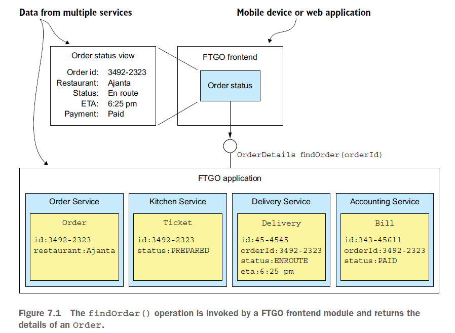
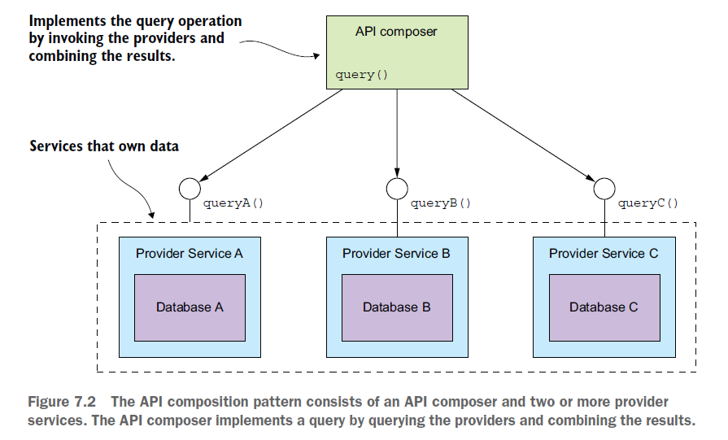
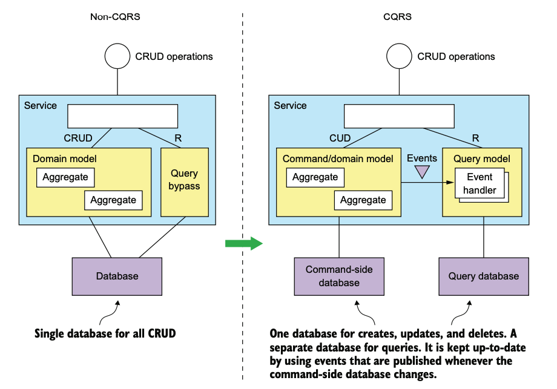
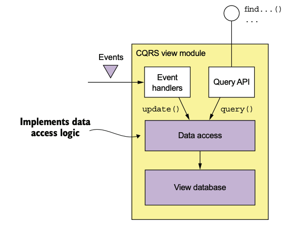

마이크로서비스 패턴 (크리스 리처드슨 저)의 7장 내용을 다룹니다.
마이크로서비스 아키텍처에서 쿼리를 작성할 때는 흩어져 있는 데이터를 검색해야하므로 어려울 수 있습니다.
이 장에서는 마이크로서비스 아키텍처에서 데이터를 쿼리하는 문제를 다음 방법으로 해결해 봅니다.
* API composition pattern API 조합 패턴
  * 클라이언트가 각 서비스들을 호출하고 결과를 결합하는 책임을 지는 방식으로 동작합니다.
* Command query responsibility segregation 커맨드 쿼리 책임 분산 (CQRS)

## API Composition Pattern

모놀리식의 경우(데이터가 단일 데이터베이스에 저장되는 경우) 여러 개의 테이블을 조인하는 select문으로 쉽게 구현할 수 있습니다.  
하지만 마이크로서비스 기반의 애플리케이션에서는 데이터가 여러 서비스에 흩어져 있습니다. 주문 세부 정보가 필요한 모든 고객은 위 모든 서비스에 요청을 해야합니다.

API composition pattern을 사용하면 이를 쉽게 구현할 수 있습니다. 

### Overview

* API composer
  * 클라이언트의 요청을 받아, 여러 Provider Services로부터 필요한 데이터를 가져오는 역할을 합니다. 
  * 이 데이터는 클라이언트가 필요로 하는 형식으로 조합되고, 이 조합된 데이터는 클라이언트에게 응답으로 반환됩니다.
* Provider Service
  * API Composer로부터 요청을 받아, 해당 서비스가 가지고 있는 데이터나 기능을 반환하는 역할을 합니다. 
  * 이 서비스들은 독립적으로 운영되며 서로 다른 데이터와 기능을 가질 수 있습니다.

예제에서는 각 Provider service를 REST API 호출을 통해 결과를 가져오고 API composer에서 이를 조인하여 응답합니다.  
(물론 다른 통신 프로토콜을 사용하는 경우에도 사용할 수 있습니다.)

### Design Issue
1. 어떤 컴포넌트가 API composer가 될 것인가?
* 프론트엔드 클라이언트
* API 게이트웨이
  * API composition 외에도 모든 마이크로 들어오는 요청을 통합적으로 관리하는 역할을 합니다.
* 독립된 서비스 (stand-alone application)

2. 어떻게 효과적인 aggregation logic을 작성할지
* 느린 aggregation logic은 전체 시스템의 성능을 저하시키고, 클라이언트의 요청을 늦게 처리하는 결과를 초래할 수 있습니다.
* 이 과정에서 가능한 한 응답 시간을 최소화하기 위해 Provider services에 동시에 호출을 하는 것이 일반적입니다.
* 어떤 Provider service의 경우에는 다른 서비스들로부터의 결과가 필요한 경우가 있을 수 있습니다. 이렇게 병렬로 처리할 부분과 순차적으로 처리할 부분을 조합하는 방식은 복잡성을 증가시킵니다.
* 복잡성을 관리하기 위해 API composer은 reactive programming model을 사용하는 것이 좋습니다.

### Drawbacks

이 패턴은 마이크로서비스 아키텍처에서 쿼리 작업을 구현하는 간단하고 직관적인 방법이지만, 다음과 같은 단점이 있습니다.

1. 증가된 오버헤드
* 여러 개의 서비스를 호출하고 여러 데이터베이스에 쿼리를 날려야하므로 이로 인한 추가적인 리소스를 필요하게 됩니다.

2. Availability 감소의 위험
* API composer와 Provider services가 함께 동작해야하므로 전체 시스템의 가용성이 개인별 서비스 가용성보다 낮아질 수 있습니다. 하나의 서비스가 비정상 상태가 되면 그 서비스를 이용하는 API composition도 영향을 받게 되므로 가용성이 감소하는 문제가 발생할 수 있습니다.

가용성 감소 문제에 대해 몇 가지 개선 방법을 제시하고 있습니다.
* Provider service가 사용 불가능할 때 이전에 캐시된 데이터를 반환하는 방법입니다. 이 방법을 사용하면 가용성을 향상시킬 수 있지만, 반환된 데이터가 최신 상태가 아닐 수 있다는 문제점이 있습니다.
* API composer가 불완전한 데이터를 반환하는 방법입니다. 일부 서비스가 일시적으로 사용이 불가능하면 해당 데이터를 생략하고 나머지 데이터만 반환하는 것입니다.

3. Transactional Data Consistency의 결여
* 모놀리식 애플리케이션엥서는 쿼리 연산을 하나의 데이터베이스 트랜잭션으로 실행하는 경우가 많습니다. 이는 일반적으로 애플리케이션에서 데이터의 일관된 뷰를 보장합니다.
* API composition pattern에서는 여러 데이터베이스에 대해 여러 쿼리를 실행합니다. 여기서 일관성이 없는 데이터를 반환하는 문제가 발생할 수 있습니다. 

이 외에도 대량의 데이터셋에 대해 in-memory join을 수행해야하는 경우에는 API composition이 적합하지 않습니다. 메모리에 큰 양의 데이터를 저장하고 데이터를 처리하는데 상당한 리소스를 사용하기 때문에 성능 문제가 발생하거나 시스템이 전체적으로 느려질 수 있습니다.

API composition pattern의 한계점을 극복하기 위해 CQRS 패턴을 사용할 수 있습니다.

## CQRS 패턴

CQRS는 커맨드와 쿼리의 책임을 분리하는 설계 패턴입니다.
* Command: 상태 변경을 요청하는 작업입니다. 새 데이터를 추가하거나 기존 데이터를 업데이트하는 것이 이에 해당합니다.
* Query: 정보를 요청하는 작업입니다. 일반적으로 상태를 변경시키지 않고, 필요한 데이터를 조회하는 것에 해당합니다.

### Overview
CQRS는 마이크로서비스 아키텍처에서 쿼리를 구현하는 다음 문제들의 해결책이 될 수 있습니다.
1. 비효율적인 in-memory join
* API composition patern의 in-memory join은 많은 양의 데이터를 처리해야 할 때는 비효율적일 수 있습니다.
2. 지원하지 않는 데이터베이스나 형식
* 서비스가 데이터를 효율적인 쿼리를 지원하지 않는 데이터베이스에 저장하고 있을 수 있습니다. 이는 쿼리를 수행하는데 추가적인 시간이나 리소스를 필요로 할 수 있습니다.
3. 관심사 분리 원칙
* 복잡한 쿼리가 필요한 경우 데이터를 가진 서비스에서 직접 쿼리하는 것이 적합하지 않을 수 있습니다.

* non-CQRS
  * 일반적으로 CRUD 작업이 도메인 모델(데이터베이스에 매핑)을 통해 실행됩니다.
  * 하나의 데이터 모델이 커맨드(데이터 변경 작업)과 쿼리(데이터 조회 작업)을 모두 지원합니다.
* CQRS
  * 커맨드와 쿼리로 나뉘며, 커맨드 도메인 모델은 CRUD 작업을 처리하고 별도의 데이터베이스에 매핑이 됩니다. 데이터가 변경될 때마다 도메인 이벤트를 발행합니다.
  * 쿼리 사이드는 복잡한 쿼리를 처리하는 별도의 모델을 말합니다. 지원하는 쿼리 유형에 가장 적합한 데이터베이스를 사용합니다. 이벤트 핸들러를 가져 커맨드 사이드에서 발행한 이벤트를 구독하고 이에 따라 데이터베이스를 업데이트합니다.
  * 쿼리 처리 성능을 향상시키는 데 검색 엔진과 같은 도구를 사용할 수 있습니다.

### Benefits
1. 마이크로서비스 아키텍처에서의 효율적인 쿼리 구현이 가능합니다.
* 기존의 API 조합 패턴에서는 메모리 내에서 데이터를 조인하는데 비효율적일 수 있습니다. 
* CQRS는 서비스 간의 데이터를 미리 조인한 형태로 보관하고, 쿼리할 때 이를 활용하여 효율적인 쿼리를 가능하게 합니다.
2. 다양한 쿼리의 구현이 가능합니다.
* 특정 쿼리를 효율적으로 구현하는 하나 이상의 뷰를 정의합니다.
3. 이벤트 소싱 기반 애플리케이션에서의 쿼리가 가능합니다.
* 이벤트 소싱(Event Sourcing)은 상태 변경을 이벤트라는 일련의 변경 로그로 저장하는 방법론입니다. 이벤트 소싱은 시스템의 상태를 변경하는 모든 행동을 이벤트로 캡처하며, 이벤트는 순서대로 저장되고, 이러한 이벤트의 시퀀스로 시스템의 상태를 재현하거나 재생성할 수 있습니다. 이 방법은 비즈니스 요구 사항이 변해도 시스템이 그 변화에 대응할 수 있게 만들어주며, 언제 어떤 이벤트가 발생했는지에 대한 완벽한 기록을 제공합니다.
* 그러나 이벤트 소싱의 한계 중 하나는 이벤트 저장소(Event Store)가 기본 키에 기반한 쿼리만 지원한다는 것입니다. 즉, 특정 키를 사용해 직접적인 조회를 할 수 있지만, 그 외의 복잡한 쿼리나 조건을 통한 검색은 어렵습니다.
* CQRS를 이벤트 소싱과 함께 사용하면, 애플리케이션은 'Aggregates'의 'View'를 정의하고, 그 뷰는 이벤트 소싱 기반의 집합체가 발행하는 이벤트 스트림을 구독하며 업데이트됩니다. Aggregates는 도메인 모델의 일부를 나타내며, 그 상태는 이벤트를 통해 변경됩니다. 이렇게 만들어진 뷰는 여러 가지 복잡한 쿼리를 처리할 수 있게 해주므로, 이벤트 소싱을 기반으로 한 애플리케이션에서 복잡한 쿼리를 가능하게 합니다. 
4. 관심사의 분리 개선
* CQRS가 하나의 서비스 내에서 '커맨드'과 '쿼리'를 처리하는 부분을 분리함으로써 서비스의 복잡성을 줄이고 유지보수를 용이하게 한다는 것을 의미합니다. 예를 들어, 커맨드는 비즈니스 로직을 처리하고 쿼리는 데이터 조회를 처리하게 됩니다. 이렇게 분리함으로써 각 부분은 자신의 역할에만 집중할 수 있게 됩니다.
5. 데이터를 소유한 서비스와 쿼리를 구현하는 서비스를 분리가 가능합니다.
* CQRS를 이용하면 '데이터를 소유하는 서비스'와 '쿼리를 실행하는 서비스'가 서로 다른 서비스로 분리될 수 있다는 것을 의미합니다. 예를 들어, '주문 데이터'를 소유한 주문 서비스와 주문 조회를 처리하는 주문 조회 서비스가 별도로 존재할 수 있습니다. 이렇게 분리하면 특정 서비스의 부하가 다른 서비스에 영향을 미치는 것을 방지하고, 각 서비스를 독립적으로 확장할 수 있게 됩니다.

### Drawbacks
1. 아키텍처의 복잡성이 증가합니다.
* 데이터를 갱신하고 쿼리하는 쿼리-사이드 서비스를 추가로 구현해야 하며, 이로 인해 추가적인 운영 복잡성이 발생할 수 있습니다. 
* 여러 타입의 데이터베이스를 사용하게 되어 더 많은 복잡성을 더하게 됩니다.

2. 커맨드, 쿼리 간의 지연이 있을 수 있습니다.
* 커맨드 사이드에서 이벤트를 발행하고 쿼리 사이드에서 이를 처리하여 뷰를 업데이트하는 사이에는 약간의 지연이 있을 수 있습니다.
* 불일치를 사용자에게 노출하지 않도록 지연되는 부분을 고려해서 구현해야 합니다.

### Designing Views

##### View Data Store 선택
* SQL
  * 트랜잭션과 쿼리 기능이 잘 구성되어 있으나 데이터 모델이 비교적 유연하지 않아 요구 사항을 만족시키는 데 어려움이 있을 수 있습니다.
* NoSQL
  * 트랜잭션 및 일반 쿼리 기능이 제한적이지만 CQRS 뷰는 간단한 트랜잭션과 고정된 쿼리만 실행하기 때문에 제한 사항에 크게 영향을 받지 않습니다.
  * NoSQL는 유연한 데이터 모델과 더 나은 성능 및 확장성을 강점으로 CQRS 뷰에 적용할 수 있습니다.
  * 책에 나오는 AWS DynamoDB는 NoSQL 서비스입니다.
  * 두 개 이상의 서비스가 발행사는 이벤트를 구독하고 그에 따라 뷰를 업데이트해야하는 경우도 있습니다. 이 경우 외래 키를 기반으로 데이터를 업데이트해야 할 수 있습니다. NoSQL의 경우 기본 키를 사용한 연산에 최적화되어 있기 때문에 외래 키 기반의 업데이트를 위한 추가 구현이 필요할 수 있습니다.

##### Data access 모듈
* 동시 업데이트
  * 여러 aggregate types에서 발행하는 이벤트를 구독하는 경우, 여러 이벤트 핸들러가 동시에 동일한 레코드를 업데이트할 수 있습니다. 
  * 하나의 업데이트가 다른 업데이트를 덮어쓰는 것을 허용할 수는 없으므로 pessimistic locking 또는 optimistic locking을 사용하여 이를 해결할 수 있습니다.
    * pessimistic locking: 데이터를 읽은 후 변경하기 전에 레코드에 락을 걸어 다른 트랜잭션들이 해당 레코드를 변경할 수 없도록 합니다. 이를 통해 동시에 레코드를 변경하려는 다른 트랜잭션의 개입을 막아 데이터 충돌을 방지합니다.
    * optimistic locking: 레코드를 읽을 때 락을 걸지 않습니다. 대신, 레코드를 업데이트하는 시점에 그 레코드가 마지막으로 읽은 이후에 변경되지 않았는지 확인합니다. 이 값이 변경된 경우 충돌이 발생했음을 알리고 해당 트랜잭션을 롤백합니다. 
* 멱등성(idempotency)
  * 같은 이벤트를 여러 번 받을 수 있는데, 이 경우 일반적으로 쿼리 측 이벤트 핸들러가 멱등하다면 문제가 되지 않습니다.
  * 이벤트 핸들러가 멱등하지 않는 경우 신뢰성을 유지하기 위해 이벤트 ID를 기록하고 데이터 저장소를 atmoically 업데이트해야 합니다.
* 최종적 일관성(eventual consistency)
  * 불가피한 지연 문제(replication lag)로 클라이언트가 업데이트한 내용을 즉시 쿼리로 볼 수 없는 경우가 있습니다.
  * 이를 위해 커맨드와 쿼리 모듈은 클라이언트가 불일치를 감지할 수 있도록 지원해야 합니다.

##### CQRS 뷰 추가 및 업데이트

새로운 쿼리를 지원하기 위해 새로운 뷰를 추가하거나 스키마가 변경되었거나 뷰를 업데이트하는 코드에 버그를 수정해야해서 뷰를 재생성해야 할 때가 있습니다. 이때 다음과 같은 내용을 고려해야 합니다.
* 아카이빙된 이벤트를 이용하여 뷰를 구축합니다.
  * 메시지 브로커는 메시지를 무기한으로 저장할 수 없습니다. 그 이전의 이벤트도 읽기 위해 메시지 브로커와 별도로 아카이빙된 이벤트를 읽어서 뷰를 구축합니다.
* 시간이 지남에 따라 점점 모든 이벤트를 처리하는데 비용이 많이 들게 됩니다.
  * two-step incremental algorithm으로 해결할 수 있습니다.
    1. Snapshot Creation: 이 단계에서는 각 aggregate instance의 스냅샷을 주기적으로 계산합니다. 이는 이전 스냅샷과 그 이후에 발생한 이벤트를 기반으로 합니다. 이렇게 하면 각 aggregate instance의 상태를 빠르게 알 수 있게 됩니다. 이렇게 생성된 스냅샷은 일종의 체크포인트 역할을 합니다.
    2. View Building: 이 단계에서는 스냅샷과 그 이후에 발생한 이벤트를 사용하여 뷰를 생성합니다. 이로써 뷰는 최신 상태로 업데이트됩니다.
  * 이 알고리즘의 장점은 모든 이벤트를 처음부터 다시 처리할 필요 없이 뷰를 업데이트할 수 있다는 것입니다. 대신, 가장 최근의 스냅샷에서 시작하여 이후에 발생한 이벤트만 처리하면 됩니다. 이는 뷰를 업데이트하는 데 필요한 시간과 리소스를 크게 줄여줍니다.

## 참조
* [마이크로서비스 패턴 - 크리스 리처드슨 저](https://www.yes24.com/Product/Goods/86542732)
* [Microservice Architecture > Pattern: API Composition](https://microservices.io/patterns/data/api-composition.html)
* [Microservice Architecture > Command Query Responsibility Segregation (CQRS)](https://microservices.io/patterns/data/cqrs.html)