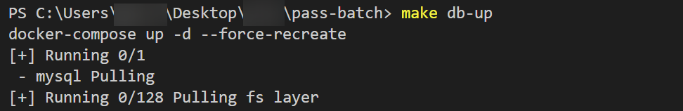

이 글에서는 Windows에서 GNU Make를 설치하고 make 명령어를 사용해보겠습니다.

## Make
* Unix 계열 운영체제를 대상으로 만들어진 프로그램 빌드 도구를 말합니다.
* Makefile(빌드 자동화 스크립트 파일) 정의를 통해 복잡한 작업을 자동화 시킬 수 있습니다.

  강의에서는 Docker를 올리고 내리는 작업을 각각 정의하였습니다.
* Windows에서 이 명령어를 수행하기 위해서는 별도의 설치가 필요합니다.

  Windows용 intaller는 [여기](https://gnuwin32.sourceforge.net/packages/make.htm)를 통해 다운로드 받을 수 있습니다.

  하지만 버전이 오래되기도 하고(3.81, 2006년 업데이트) 설치 후 환경 변수도 설정해줘야 해서 여기서는 [Chocolatey](https://chocolatey.org/)를 통해 설치하겠습니다.

## Chocolatey
* Windows에서 사용할 수 있는 커맨드 라인 패키지 관리자입니다.

  Linux의 yum, MacOS의 Homebrew를 생각하시면 됩니다.

* Choco의 설치 방법은 [Installing Chocolatey](https://chocolatey.org/install#individual)에 자세히 설명되어 있습니다.

  함께 과정을 따라가봅시다.

## Chocolatey 설치

1. 먼저 PowerShell을 관리자로 실행합니다.


2. [Installing Chocolatey](https://chocolatey.org/install#individual) 내 다운로드 명령어를 복사 후 붙여넣기 해줍니다.


3. Choco 설치가 완료되었습니다. `choco`또는 `choco -?`로 확인합니다.


## Make 설치
* Choco를 통해 make를 설치하는 방법은 간단합니다.

```
choco install make
```


* 설치가 완료되었습니다! 정의해둔 위치에서 make 명령어를 수행합니다.




## 마치며
* Chocolatey를 통해 간단한 명령어로 패키지를 업데이트하거나 다른 패키지를 설치하는데 유용하게 사용할 수 있을 것입니다.
* Makefile에 자동화 할 동작이 있다면 추가로 정의해봐도 좋을 것 같습니다.

오늘도 좋은 하루 되세요. 감사합니다. 😁

